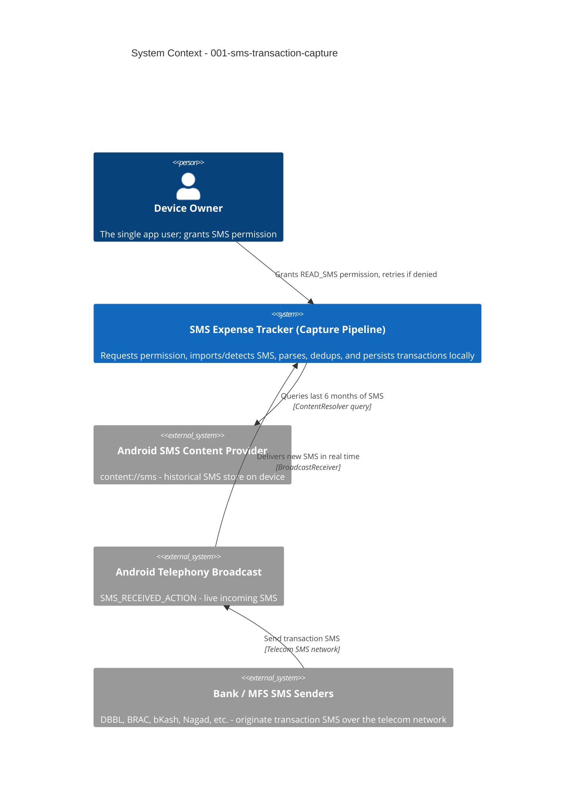

# SMS Transaction Capture - System Context

## System Overview

An on-device capability that requests SMS read access, scans the device's SMS inbox (bounded to the last 6 months on first grant) and live incoming SMS thereafter, filters out non-transactional messages (OTP/promotional), parses transaction-relevant SMS from 20 Bangladeshi banks and 4 MFS providers using a configurable regex engine, classifies the transaction type, deduplicates, and persists structured records to a local Room database. No data leaves the device; there is no server component in this intent.

## Context Diagram

## External Integrations

- **Android SMS Content Provider** (`content://sms`): Source of historical SMS for bulk import. Read-only query via `ContentResolver`. No writes, ever.
- **Android Telephony SMS Broadcast** (`SMS_RECEIVED_ACTION`): Source of live incoming SMS via `BroadcastReceiver`. Read-only observation; receiver never calls `abortBroadcast()` and never triggers `SEND_SMS`.
- **Bank / MFS SMS Senders**: Not directly integrated — these are the upstream originators of the SMS content consumed via the two Android system interfaces above. No direct network/API integration with banks in this intent.

## High-Level Constraints

- Must run entirely on-device; no backend/API calls from this intent's pipeline
- Must never request or use `SEND_SMS`
- Personal/sideload distribution assumed (not Play Store) — revisit before any Play Store submission given SMS permission policy restrictions
- Assumed `minSdk 26` (Android 8.0) / latest stable `targetSdk`, pending final confirmation

## Key NFR Goals

- Import of up to ~10,000 historical SMS (6-month window) completes in background without blocking the UI or triggering ANR
- Live-detected SMS parsed and persisted within 3 seconds of arrival
- 100% of sender-recognized transaction SMS logged (matched or flagged for review) — nothing silently dropped
- Zero network egress from the capture/parse/persist path
